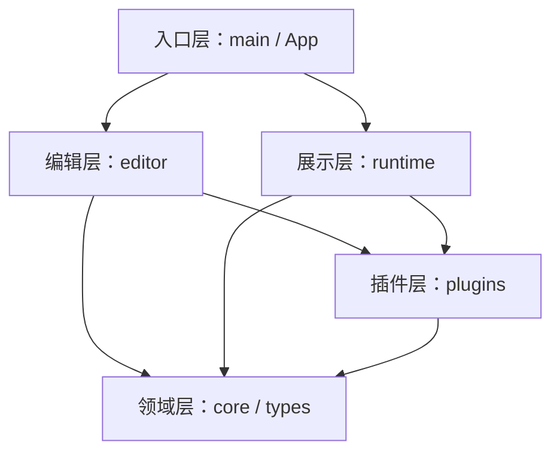
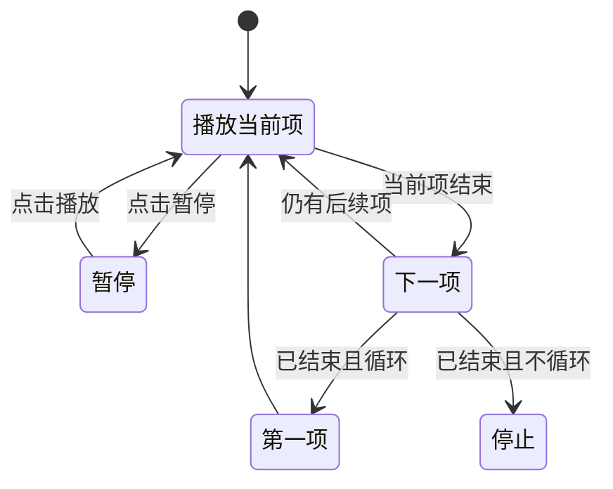
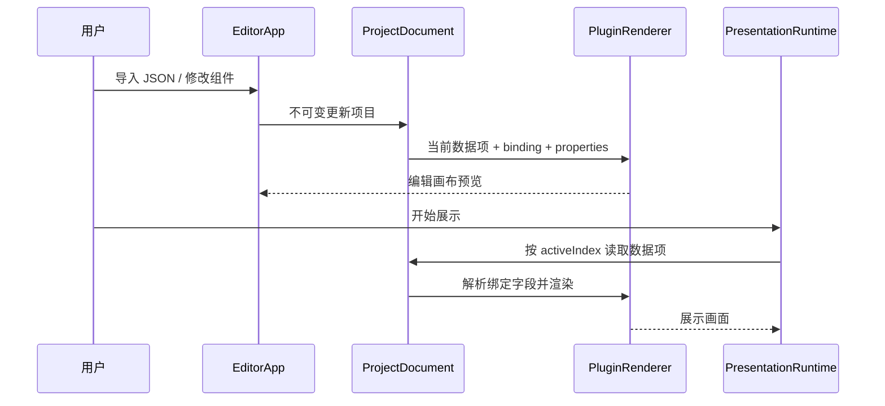

# 插件式时序展示编辑器：项目架构说明

本文档面向首次接手项目的开发者，说明项目的设计目标、模块边界、核心数据结构、编辑与展示流程、插件扩展方法、开发验证方式以及当前架构限制。

> 适用版本：`ProjectDocument.version = 1`，React 19 + TypeScript 5.9 + Vite 8。

## 1. 项目定位

本项目是一个完全运行在浏览器中的静态可视化编辑器。它将一组结构相近的 JSON 数据对象，按照时间轴依次展示在固定逻辑分辨率的画布中。

页面由“组件实例”组成。每个组件实例选择一种内置插件，并通过字段路径绑定 JSON 数据。例如：

- 文本组件绑定 `title`。
- 图片组件绑定 `image`。
- 图表组件绑定 `metrics`。
- 当时间轴从第一个数据对象切换到第二个数据对象时，组件位置和样式保持不变，只更新绑定字段对应的值。

项目包含两种互斥模式：

| 模式 | 入口组件 | 主要职责 |
| --- | --- | --- |
| 编辑模式 | `EditorApp` | 导入数据、添加和选择组件、拖动、缩放、配置绑定与样式、预览时间轴 |
| 展示模式 | `PresentationRuntime` | 按每项时长自动播放数据对象、暂停、切换前后项、循环、等比缩放画布 |

第一版只支持随项目源码一起编译的内置插件，不支持在运行时加载远程脚本或第三方插件包。

## 2. 技术栈与运行边界

| 类别 | 方案 |
| --- | --- |
| UI 框架 | React 19 |
| 语言 | TypeScript，开启 `strict` |
| 构建工具 | Vite 8 |
| 状态管理 | React `useState` / `useEffect` / 回调属性 |
| 持久化 | 浏览器 `localStorage` |
| 布局与交互 | 全局 CSS、CSS Grid、Pointer Events、ResizeObserver |
| 播放计时 | `requestAnimationFrame` + `performance.now()` |
| 部署 | GitHub Actions 构建 `dist/`，GitHub Pages 托管 |

项目没有后端、数据库、账户系统和服务端渲染。所有项目数据、组件配置和编辑状态都在当前浏览器内处理。

## 3. 目录结构与职责

```text
.
├── .github/workflows/deploy.yml    # GitHub Pages 构建与部署
├── examples/sample-data.json       # 可导入的数据示例
├── public/favicon.svg              # 原样复制到构建产物的静态资源
├── src/
│   ├── main.tsx                    # React DOM 入口及全局样式入口
│   ├── App.tsx                     # 顶层项目状态、自动保存、模式切换
│   ├── types/
│   │   └── project.ts              # 项目、组件、插件的核心类型契约
│   ├── core/
│   │   ├── project.ts              # 默认项目、数据导入和项目规范化
│   │   └── bindings.ts             # 字段路径读取与插件绑定候选扫描
│   ├── plugins/
│   │   └── registry.tsx            # 内置插件定义、注册表与统一渲染入口
│   ├── editor/
│   │   ├── EditorApp.tsx           # 编辑模式的状态协调与业务操作
│   │   ├── EditorCanvas.tsx        # 画布缩放、拖动、缩放和网格吸附
│   │   ├── ComponentPalette.tsx    # 插件库与图层列表
│   │   ├── PropertyInspector.tsx   # 绑定、位置、尺寸、样式和画布属性
│   │   ├── TimelinePanel.tsx       # 编辑模式的静态时间轴预览
│   │   ├── TopBar.tsx              # 导入、打开、导出、重命名和展示入口
│   │   └── ui.tsx                  # 属性编辑器、图标等小型通用组件
│   ├── runtime/
│   │   └── PresentationRuntime.tsx # 展示模式的播放状态机和渲染
│   └── styles/index.css            # 编辑器、插件和展示模式的全局样式
├── index.html                      # Vite HTML 入口
├── package.json                    # 依赖、Node 版本和开发命令
├── tsconfig*.json                  # 应用与 Vite 配置的 TS 工程引用
└── vite.config.ts                  # React 插件、开发服务器和 Pages 基路径
```

## 4. 分层结构与依赖方向



依赖原则：

1. `types` 定义稳定的数据契约，不依赖编辑器或展示层。
2. `core` 负责纯数据逻辑，不直接渲染 UI。
3. `plugins` 依赖类型契约，并提供可复用的内容渲染能力。
4. `editor` 和 `runtime` 可以使用 `core` 与 `plugins`，但两者不应互相依赖。
5. `App` 只负责顶层状态和模式切换，不承载具体编辑或播放算法。

保持这个依赖方向，可以避免新增插件或修改播放逻辑时影响整个应用。

## 5. 核心数据模型

### 5.1 `ProjectDocument`

`ProjectDocument` 是导入、导出、自动保存和运行时渲染共用的唯一项目文档。

| 字段 | 含义 |
| --- | --- |
| `version` | 项目文件格式版本，当前固定为 `1` |
| `name` | 项目名称，也用于导出文件名 |
| `canvas` | 固定逻辑分辨率、网格大小和背景颜色 |
| `timeline` | 默认展示时长、过渡时长和循环开关 |
| `items` | 按时间顺序播放的 JSON 数据对象数组 |
| `components` | 画布中的组件实例数组 |

画布尺寸是逻辑像素，不直接等于浏览器中的实际像素。编辑和展示时都会计算缩放比例，但组件坐标始终保存为逻辑画布坐标。

### 5.2 `DataItem`

```ts
type DataItem = Record<string, unknown> & {
  id?: string;
  duration?: number;
};
```

除 `id` 和 `duration` 外，业务字段完全开放。项目依赖组件绑定路径解释这些字段，不在核心层预定义 `title`、`image` 或 `metrics`。

- `duration` 单位为毫秒。
- 未设置 `duration` 时，使用 `project.timeline.defaultDuration`。
- 导入时若提供 `duration`，必须是大于等于 `100` 的数字。
- `id` 当前主要用于 React 列表键、图片标识和调试展示，不要求强制存在或全局唯一。

### 5.3 `ComponentInstance`

| 字段 | 含义 |
| --- | --- |
| `id` | 实例唯一标识，用于选择、更新、删除和 React key |
| `pluginType` | 插件注册表中的键，例如 `builtin.text` |
| `binding` | 数据字段路径，例如 `metrics.完成度`；运行时插件使用空字符串 |
| `x` / `y` | 组件左上角在逻辑画布中的坐标 |
| `width` / `height` | 组件逻辑尺寸 |
| `zIndex` | 图层顺序；渲染前按升序排列 |
| `properties` | 插件私有配置，由插件定义解释 |

数据绑定插件的实例不保存某个时间点的具体内容。内容始终通过 `binding` 从当前 `DataItem` 动态读取，因此同一布局可以复用于全部时间轴对象。运行时插件将 `acceptedTypes` 声明为空数组，不显示数据绑定面板，并从 `PluginRenderContext` 获取播放状态等运行时数据。

### 5.4 `PluginDefinition`

插件定义同时承担元数据、默认值、属性表单声明和最终渲染函数四种职责：

```ts
type PluginDefinition = {
  type: string;
  name: string;
  glyph: string;
  description: string;
  acceptedTypes: ValueType[];
  defaultSize: { width: number; height: number };
  minimumSize?: { width: number; height: number };
  defaultProperties: Record<string, unknown>;
  propertySchema: PluginProperty[];
  render: (context: PluginRenderContext) => ReactNode;
};
```

展示运行时会通过 `PluginRenderContext` 额外传入 `mode`、可选的 `transition` 和可选的 `playback`。`transition` 包含上一数据项、上一绑定值、切换序号和项目默认过渡时长；`playback` 包含当前对象进度与整个时间轴进度。插件由此可以处理展示动画或读取播放状态，编辑模式仍通过同一个渲染入口预览。

`minimumSize` 未提供时使用编辑器默认值 `80 × 56`；细长组件可声明更小的尺寸限制。

`propertySchema` 目前支持 `text`、`number`、`color` 和 `select`。如果插件需要布尔值、多行文本、文件选择等新控件，需要先扩展 `PluginProperty` 与 `PropertyEditor`。

## 6. 应用入口与顶层状态

`src/main.tsx` 创建 React 根节点，加载 `App` 和全局样式。

`App` 持有两个顶层状态：

- `project`：完整 `ProjectDocument`。
- `presenting`：当前是否进入展示模式。

初始化顺序如下：

1. 从 `localStorage` 读取 `timeline-studio-vite-project-v1`。
2. 若存在缓存，则解析 JSON 并调用 `normalizeProject`。
3. 解析或校验失败时，回退到 `createDefaultProject()`。
4. `project` 每次变化后，重新序列化并写入 `localStorage`。

模式切换采用条件渲染：

```text
presenting = false → EditorApp
presenting = true  → PresentationRuntime
```

进入展示模式不会复制项目数据；展示模式读取进入时的同一个项目状态。退出展示模式后重新挂载 `EditorApp`，其中仅属于编辑界面的临时状态会重新初始化。

## 7. 编辑模式架构

### 7.1 `EditorApp`：编辑业务协调器

`EditorApp` 不直接实现画布指针算法或插件 UI，而是集中管理编辑模式状态和跨组件操作：

- 当前选中的组件 `selectedId`。
- 当前预览的数据项 `activeIndex`。
- 操作提示 `toast`。
- 添加、复制、删除和更新组件。
- 导入数据、导入项目和导出项目。
- 键盘删除和方向键移动。

所有项目更新都采用不可变更新，确保 React 能检测到引用变化：

```ts
setProject((current) => ({
  ...current,
  components: current.components.map(...),
}));
```

新增业务操作时，应继续通过函数式 `setProject` 读取最新值，避免闭包持有旧状态。

### 7.2 编辑界面区域

桌面布局由 `studio-shell` 的 CSS Grid 划分：

| 区域 | 组件 | 职责 |
| --- | --- | --- |
| 顶栏 | `TopBar` | 项目名、导入、打开、导出、进入展示 |
| 左栏 | `ComponentPalette` | 插件库、添加组件、图层选择、数据状态摘要 |
| 中央 | `EditorCanvas` | 可缩放画布、选择、拖动、调整尺寸 |
| 右栏 | `PropertyInspector` | 数据绑定、几何属性、插件属性、画布和时间轴设置 |
| 底栏 | `TimelinePanel` | 数据项选择、单项时长和总时长预览 |

窄屏下 CSS 会缩小侧栏；宽度小于 `820px` 时隐藏右侧属性面板。因此当前产品主要面向桌面编辑，移动端只提供有限浏览能力。

### 7.3 组件新增、复制与删除

新增组件：

1. 从 `PLUGIN_REGISTRY` 读取插件定义。
2. 使用当前数据对象扫描兼容字段。
3. 默认绑定第一个兼容字段；没有候选时回退为 `title`。
4. 使用插件默认尺寸和默认属性创建实例。
5. 根据现有组件数量产生错位，避免完全重叠。
6. 新组件的 `zIndex` 设为当前最大值加一。
7. 追加到 `project.components` 并自动选中。

复制组件会浅复制实例与 `properties`，将位置偏移两个网格，并放到最上层。

删除组件会从 `components` 中过滤对应 `id`，随后清空选择。

当前实例 ID 使用 `插件类型 + Date.now()` 生成。一般交互下足够使用，但如果未来支持批量创建或多人协作，应改为 `crypto.randomUUID()` 或由数据层统一分配 ID。

### 7.4 画布缩放

编辑器使用 `ResizeObserver` 监听工作区尺寸，并计算：

```text
scale = min(
  (workspaceWidth - 72) / canvasWidth,
  (workspaceHeight - 72) / canvasHeight,
  1
)
```

缩放下限为 `0.15`，上限为 `1`。画布通过 CSS `transform: scale(...)` 显示，但项目内坐标不变。

处理指针位移时，需要除以 `scale` 将屏幕像素转换为逻辑像素：

```text
logicalDelta = pointerDelta / scale
```

任何新增的画布交互都必须遵守这一坐标转换，否则缩放状态下会出现拖动距离不一致。

### 7.5 网格吸附与边界

默认使用以下公式吸附网格：

```text
round(value / gridSize) * gridSize
```

按住 `Alt` 时暂时关闭网格吸附，但仍将值四舍五入为整数。拖动时会把组件限制在画布范围内。

四个角的缩放手柄分别调整对应边，最小宽度为 `80`，最小高度为 `56`，并限制组件不能越过画布右侧和底部。

注意：右侧属性面板直接写入数值，目前不会自动吸附或进行完整边界校验。若后续增强属性编辑，需要复用统一的几何约束函数，避免拖动和表单修改产生不同规则。

### 7.6 键盘交互

- `Delete` / `Backspace`：删除选中组件。
- 方向键：每次移动一个 `gridSize`。
- 当焦点位于 `input`、`select` 或 `textarea` 时，不处理画布快捷键。

方向键移动会限制组件不超出画布。

## 8. 数据绑定系统

### 8.1 路径读取

`getValueByPath(item, path)` 使用英文句点分隔路径，例如：

```text
title
metrics.完成度
statistics.sales
```

特殊路径 `$item` 会返回整个数据对象。

当前实现不支持：

- 数组索引语法，例如 `items[0].value`。
- 对象键本身包含英文句点。
- 可选链或表达式计算。

如果需要这些能力，应把字符串分割逻辑替换为明确的路径解析器，并为路径格式增加测试。

### 8.2 绑定候选扫描

`getCompatibleBindings` 会递归遍历当前数据对象，并将字段实际类型与插件的 `acceptedTypes` 比较。

支持的类型是：

```text
string | number | boolean | array | object
```

扫描规则：

- `null` 和 `undefined` 不作为候选。
- 普通对象继续递归，数组只作为整体候选，不遍历元素。
- 递归深度限制为 4 层。
- 当前只根据编辑器正在预览的那一项生成候选。

因此，导入数据虽然期望各项结构一致，但系统没有验证所有项都拥有同名同类型字段。开发数据导入功能时，应考虑是否增加跨项字段一致性检查和缺失字段提示。

### 8.3 编辑与展示共用解析逻辑

编辑画布和展示运行时都执行同一条渲染链：

```text
当前 DataItem
  → getValueByPath(binding)
  → PluginRenderer
  → 插件 definition.render(context)
```

这是项目最重要的复用点。不要在编辑画布中单独实现一套插件内容渲染，否则编辑预览和最终展示会发生偏差。

## 9. 插件系统

### 9.1 注册表

所有插件集中注册在 `PLUGIN_REGISTRY`：

```ts
Record<string, PluginDefinition>
```

当前内置插件：

| 插件类型 | 接受数据 | 作用 |
| --- | --- | --- |
| `builtin.text` | `string`、`number` | 标题、正文和数值文本 |
| `builtin.image` | `string` | 图片 URL 或相对路径 |
| `builtin.chart` | `object`、`array`、`number` | 将数值转换为横向条形图 |
| `builtin.progress` | 运行时播放状态 | 显示当前对象或整个时间轴的播放进度 |

`PluginRenderer` 是统一入口。若 `pluginType` 不存在，会渲染“未知插件”占位内容，而不是让整个页面崩溃。

### 9.2 图表数据转换

条形图插件内部的 `toChartEntries` 支持三类输入：

1. 单个数字：转换为一个名为“数值”的条目。
2. 数字数组：索引生成“项目 N”。
3. 对象数组：寻找对象中的第一个数字字段，标签优先使用 `label` 或 `name`。
4. 普通对象：保留所有值为数字的键值对。

条形长度相对于当前可见条目中的最大值计算，不使用固定业务量程。

### 9.3 进度条插件

`builtin.progress` 不绑定 JSON 字段，其 `acceptedTypes` 为空数组。编辑模式固定显示 50%，便于调整位置、尺寸与颜色；展示模式从 `PluginRenderContext.playback` 读取真实进度。

进度模式包括：

- `item`：当前数据对象从 0 到 100% 的播放进度，切换对象时归零。
- `timeline`：已完成对象时长与当前对象已播放时长之和，占整个时间轴总时长的比例。

横向进度从左向右填充，纵向进度从下向上填充。插件还支持前景色、轨道色和圆角属性。原先固定在展示页面底部的全局进度条已经移除，进度条的位置和实例数量完全由项目组件决定。

### 9.4 新增插件的标准步骤

以新增徽章插件为例：

1. 在 `src/plugins/registry.tsx` 中新增唯一注册键。
2. 声明接受的数据类型。
3. 提供默认尺寸与完整的默认属性。
4. 使用 `propertySchema` 声明属性面板。
5. 实现纯渲染函数，并处理空值和错误值。
6. 在 `src/styles/index.css` 添加插件内部样式。
7. 使用多条时间轴数据验证类型兼容和切换效果。

```tsx
"builtin.badge": {
  type: "builtin.badge",
  name: "徽章",
  glyph: "●",
  description: "短文本状态标签",
  acceptedTypes: ["string", "number"],
  defaultSize: { width: 220, height: 64 },
  defaultProperties: {
    color: "#17211d",
    background: "#d6f15a",
  },
  propertySchema: [
    { key: "color", label: "文字颜色", type: "color" },
    { key: "background", label: "背景颜色", type: "color" },
  ],
  render: ({ value, properties }) => (
    <div style={{
      color: String(properties.color),
      background: String(properties.background),
    }}>
      {value == null ? "未绑定" : String(value)}
    </div>
  ),
},
```

如果只使用现有属性类型，新增插件通常不需要修改 `EditorApp`、`EditorCanvas`、`PropertyInspector` 或 `PresentationRuntime`。

运行时插件应把 `acceptedTypes` 设置为空数组，并从渲染上下文读取运行时数据；此类插件不会显示数据绑定面板。

### 9.5 插件开发约束

- `render` 应尽量是纯函数，不自行修改项目状态。
- 插件根节点应占满组件实例尺寸，通常设置 `width: 100%` 和 `height: 100%`。
- 必须处理 `undefined`、类型不符、空数组和空对象。
- 不要依赖编辑模式独有的 DOM 结构，因为同一渲染函数也用于展示模式。
- `defaultProperties` 应覆盖 `propertySchema` 中的全部键，避免新实例出现未定义属性。
- 只在展示模式使用的动画应检查 `mode === "presentation"`，并通过 `transition` 读取上一值；不要依赖全局计时器猜测数据何时切换。
- 组件级动画时长统一使用 `animationDuration`，旧项目缺少该属性时由 `PluginRenderer` 合并插件默认属性。
- 远程图片由浏览器直接加载；未来如需截图、Canvas 合成或导出图片，需要额外处理跨域资源限制。

## 10. 导入、导出与持久化

### 10.1 导入数据

“导入数据”接受两种 JSON 顶层形式：

```json
[
  { "title": "第一项" },
  { "title": "第二项" }
]
```

或：

```json
{
  "items": [
    { "title": "第一项" },
    { "title": "第二项" }
  ]
}
```

导入数据只替换 `project.items`，不会改变画布、时间轴设置和组件布局。导入完成后将预览索引重置为 0。

`examples/sample-data.json` 虽然包含 `version` 和 `timeline`，但使用“导入数据”时只有其中的 `items` 会生效。

### 10.2 导入项目

“打开项目”调用 `normalizeProject`，要求：

- 输入是对象。
- `version === 1`。
- 存在 `canvas` 和 `timeline`。
- `components` 是数组。
- `items` 能通过数据导入校验。

当前规范化主要验证必要结构，没有对组件坐标、插件类型、属性类型、画布尺寸等进行深度校验。来自不可信来源的项目文件可能产生无效 UI 状态，后续可考虑使用 Zod、JSON Schema 或自定义类型守卫完善校验。

### 10.3 导出项目

导出操作将完整 `ProjectDocument` 格式化为 JSON，通过 Blob URL 下载。文件名来自 `project.name`，为空时使用 `timeline-project.json`。

导出的项目包含业务数据和布局配置，因此可以被“打开项目”完整恢复。

### 10.4 自动保存

每次 `project` 引用变化，`App` 都会同步写入 `localStorage`。这适合当前小型单项目场景，但有以下限制：

- 存储容量通常只有数 MB。
- 同一浏览器只有一个固定存储槽。
- 清除站点数据会丢失缓存。
- 高频拖动会触发大量同步序列化和写入。

如果未来项目规模明显扩大，应引入防抖、多个项目槽位或 IndexedDB。导出 JSON 仍应作为可靠的显式备份方式。

## 11. 展示模式运行逻辑

### 11.1 画布适配

展示模式使用固定逻辑画布，按窗口宽高计算：

```text
scale = min(windowWidth / canvasWidth, windowHeight / canvasHeight)
```

画布以窗口中心为变换原点等比缩放，不修改任何组件坐标和尺寸。窗口 `resize` 时重新计算比例。

### 11.2 播放状态

`PresentationRuntime` 内部维护：

| 状态 | 作用 |
| --- | --- |
| `activeIndex` | 当前数据项索引 |
| `progress` | 当前项的 0～1 展示进度，传递给运行时插件 |
| `isPlaying` | 播放或暂停 |
| `scale` | 当前窗口缩放比例 |
| `transition` | 当前交叉过渡的上一数据项和切换序号 |
| `progressRef` | 不依赖重渲染保存精确进度，支持暂停后继续 |
| `activeIndexRef` | 快速连续切换时同步保存实际索引 |

计时过程：

1. 读取当前项 `duration`，不存在时读取默认时长。
2. 用 `performance.now()` 和已保存进度计算本轮起点。
3. 每个动画帧更新进度。
4. 达到 100% 后重置进度。
5. 若不是最后一项，进入下一项。
6. 若是最后一项且 `loop = true`，回到第 0 项。
7. 若是最后一项且不循环，停止播放。



用户可以手动切换上一项或下一项。手动切换会重置进度，并通过取模方式首尾循环；该手动行为不受自动播放的 `loop` 设置限制。

按 `Esc` 或点击“退出展示”会回到编辑模式。

`PresentationRuntime` 会预先计算每项起始时间和总时长，再根据 `activeIndex` 与 `progress` 生成 `playback`。该计算结果传给所有插件，页面本身不再渲染固定进度条。

### 11.3 组件级展示动画

每次自动或手动切换数据项时，`PresentationRuntime` 会保存上一项，增加切换序号，并把前后绑定值传给每个 `PluginRenderer`。上一项最多保留到所有组件动画中的最长时长结束；快速连续切换会取消旧清理计时器，并以当前项作为新的离场项。

文字和图片插件支持逐实例配置：

- 无动画。
- 淡入淡出。
- 从左侧滑入，同时旧内容向右淡出。
- 从右侧滑入，同时旧内容向左淡出。
- `animationDuration`，范围 0～5000 毫秒。

过渡从新数据项开始时执行，并计入新数据项的 `duration`，不会额外延长时间轴。

条形图通过标签名称匹配前后条目。已有标签从旧宽度变化到新宽度；新增标签从 0 变化到目标宽度；在最大条目数允许的情况下，消失标签会向 0 收缩。宽度按前后数据各自的最大非负值归一化。条形图可以逐实例关闭数值动画或设置动画时长。

所有动画 CSS 都限定在 `.presentation-shell` 下，因此编辑模式切换预览对象时不会播放动画。是否播放动画及其时长完全由组件属性决定：需要减少动态效果时，应在组件属性中选择“无动画”或缩短动画时长。浏览器的 `prefers-reduced-motion` 不会静默覆盖项目中显式保存的展示配置。

## 12. 端到端数据流



核心思想是：`ProjectDocument` 是唯一业务真相，编辑模式改变它，插件解释它，展示模式消费它。

## 13. 常见开发任务

### 13.1 修改项目文档结构

新增或修改 `ProjectDocument` 字段时，至少检查：

1. `src/types/project.ts` 类型定义。
2. `createDefaultProject()` 的默认值。
3. `normalizeProject()` 的兼容与校验。
4. 编辑器中对应的修改入口。
5. 展示运行时是否需要消费该字段。
6. 导入、导出和 `localStorage` 中旧数据的迁移。

如果是破坏性变更，应提升 `version` 并实现显式迁移，不能只修改 TypeScript 类型。浏览器缓存和用户导出的旧 JSON 在运行时仍然存在。

### 13.2 新增组件级操作

推荐把项目更新逻辑放在 `EditorApp`，通过回调传给子组件。若操作涉及几何约束，应抽取到 `core` 下的纯函数，以便拖动、键盘和属性面板共用。

不要让 `ComponentPalette`、`TopBar` 等展示型组件直接读写 `localStorage`。

### 13.3 新增属性编辑器类型

1. 扩展 `PluginProperty["type"]`。
2. 在 `PropertyEditor` 中实现对应表单。
3. 明确 UI 值到项目 JSON 值的转换方式。
4. 为缺失值提供合理回退。
5. 至少用一个插件验证导入、编辑、导出和重新打开。

### 13.4 新增数据可视化插件

数据转换与 React 渲染应分离。先把 `unknown` 转换为稳定的内部结构，再渲染图形。这样更容易补充单元测试，也能集中处理缺失字段、负数、空数据、极值和排序规则。

若可视化需要复杂 SVG 或 Canvas，应保证编辑和展示仍通过同一个 `PluginRenderer`。

### 13.5 修改画布交互

任何交互改动都需要同时检查：

- 缩放后的屏幕坐标与逻辑坐标转换。
- 网格吸附以及按住 `Alt` 的行为。
- 四个画布边界。
- 最小尺寸。
- 指针释放和组件卸载时的清理。
- 键盘与属性面板是否遵循相同约束。

## 14. 本地开发与验证

### 14.1 环境准备

```bash
node --version
npm --version
npm ci
```

要求 Node.js `>= 22.13.0`。

### 14.2 常用命令

```bash
# 启动开发服务器
npm run dev

# 只执行 TypeScript 检查
npm run typecheck

# 类型检查并生成 dist/
npm run build

# 本地预览生产构建
npm run preview
```

`npm run build` 实际执行 `tsc -b && vite build`，任何 TypeScript 错误都会阻止生产构建。

### 14.3 修改后的最低验证清单

通用检查：

- `npm run typecheck` 通过。
- `npm run build` 通过。
- 浏览器控制台没有新增错误。
- 刷新页面后项目能够从 `localStorage` 恢复。
- 导出项目后可以重新打开。

编辑器检查：

- 添加、选择、复制和删除组件正常。
- 拖动、四角缩放、网格吸附与 `Alt` 临时关闭吸附正常。
- 不同画布缩放比例下移动距离一致。
- 时间轴切换后所有组件更新为对应项数据。
- 属性面板只显示与插件类型兼容的字段。
- 运行时插件不显示数据绑定面板，图层列表显示“运行时”。
- 细长进度条缩放时不会被强制恢复为普通组件的最小高度。

展示模式检查：

- 每项使用自己的 `duration` 或默认值。
- 暂停和继续不会丢失进度。
- 上一项、下一项、循环和非循环结束行为符合预期。
- 文字和图片的无动画、淡入淡出、左右滑入及组件级时长设置生效。
- 交叉过渡结束后旧内容节点被清理，快速连续切换不会残留更早的数据项。
- 条形图相同标签平滑改变宽度，新增标签从 0 开始，关闭动画后立即更新。
- 进度条的当前对象/整个时间轴模式、横向/纵向方向、颜色和圆角正确生效。
- 展示页面底部不再存在固定的全局进度条。
- 编辑模式切换时间轴对象时不出现展示动画。
- 窗口缩放后画布保持比例并居中。
- `Esc` 可以安全退出。

当前仓库没有自动化测试框架。新增较复杂的数据转换、迁移或几何算法时，建议引入 Vitest，并优先测试 `core` 中的纯函数。

## 15. 构建与部署

Vite 构建结果位于 `dist/`。

仓库 Pages 地址包含项目子路径，因此 `vite.config.ts` 设置：

```ts
base: "/plugin-timeline-studio-vite/"
```

`.github/workflows/deploy.yml` 在以下情况运行：

- 推送到 `main`。
- 在 Actions 页面手动执行 `workflow_dispatch`。

工作流顺序：

```text
checkout
  → Node.js 22
  → npm ci
  → npm run build
  → 上传 dist/
  → 部署 GitHub Pages
```

不要把仓库源码根目录直接配置成 Pages 发布目录。Vite 项目必须先构建，再发布 `dist/` 产物。

如果仓库名或部署路径发生变化，需要同步修改 Vite 的 `base`。如果改用自定义域名或用户名根站点，则通常应改为 `/`。

## 16. 当前架构限制与演进建议

| 现状 | 影响 | 建议方向 |
| --- | --- | --- |
| 插件在单一注册表中静态编译 | 不能运行时安装第三方插件 | 后续可拆分插件模块，但仍应保留统一类型契约 |
| 项目校验较浅 | 非法项目文件可能产生异常布局或属性 | 引入 Schema 校验和版本迁移 |
| 绑定候选只扫描当前项 | 其他时间项可能缺字段或类型不一致 | 增加跨项字段健康检查 |
| 绑定递归最多 4 层 | 更深嵌套字段不可选 | 将深度做成配置或改用安全路径索引 |
| 数组不支持子路径绑定 | 不能直接选择数组元素字段 | 定义数组绑定语法或可视化映射配置 |
| 单一 `localStorage` 槽位 | 无项目列表、容量有限 | 多项目索引、IndexedDB 或文件系统接口 |
| 拖动期间同步自动保存 | 大项目可能出现卡顿 | 保存防抖或提交式状态更新 |
| 没有撤销/重做 | 编辑错误难以恢复 | 引入命令栈或历史快照 |
| 属性面板几何值缺少统一约束 | 可输入越界或不吸附的值 | 抽取统一几何规范化函数 |
| 全局 CSS | 插件样式可能互相影响 | 采用命名规范、CSS Modules 或插件样式隔离 |
| 没有自动化测试 | 重构回归风险较高 | 使用 Vitest + React Testing Library |
| 没有路由 | 刷新只能恢复单一工作区 | 若增加项目主页或分享页，再引入路由 |

## 17. 代码约定

- 保持 TypeScript `strict` 通过，不用无依据的类型断言绕过数据问题。
- 项目状态使用不可变更新；插件渲染函数不修改外部状态。
- 业务数据使用 `unknown` 接收，在插件或转换函数边界显式收窄类型。
- 纯数据算法优先放入 `core`，React 组件只负责状态协调和渲染。
- 编辑与展示必须共用绑定解析和插件渲染。
- 新增项目字段时提供默认值、校验和旧版本兼容策略。
- 用户可见错误通过明确提示呈现，不静默吞掉可恢复的导入问题。
- 保持固定逻辑画布模型，不把浏览器缩放后的像素写回项目文档。

## 18. 新开发者建议阅读顺序

首次接手时建议按以下顺序阅读：

1. `src/types/project.ts`：理解整个项目的数据契约。
2. `src/core/project.ts`：理解默认数据与导入边界。
3. `src/App.tsx`：理解顶层状态与模式切换。
4. `src/editor/EditorApp.tsx`：理解编辑操作如何更新项目。
5. `src/core/bindings.ts`：理解 JSON 字段如何映射到组件。
6. `src/plugins/registry.tsx`：理解插件如何声明与渲染。
7. `src/editor/EditorCanvas.tsx`：理解坐标、缩放和交互。
8. `src/runtime/PresentationRuntime.tsx`：理解时间轴播放。
9. `src/styles/index.css`：最后理解界面区域和视觉实现。

掌握以上链路后，可以把整个项目概括为：

```text
JSON 数据 + 项目配置
  → ProjectDocument
  → 当前时间轴对象
  → 字段绑定
  → 插件渲染
  → 编辑画布或展示画布
```

这条链路是后续扩展和重构时最应保持稳定的核心架构。
